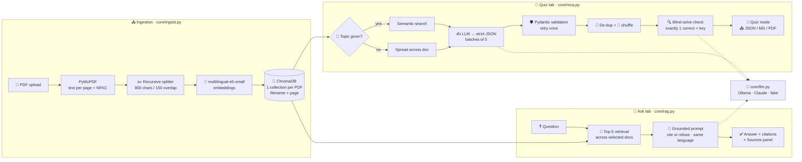

<div align="center">

# 📚 StudyRAG

### 🎓 Your AI study partner: chat with lecture PDFs and generate verified practice quizzes

**100% free · fully private · runs on your own laptop**

[](https://www.python.org/)
[](https://streamlit.io/)
[](https://www.trychroma.com/)
[](https://ollama.com/)
[](https://github.com/[YOUR-USERNAME]/studyrag/actions/workflows/tests.yml)
[](#-docker)
[](#-license)

🌍 **English** · **العربية**

[✨ Features](#-features) · [🎬 Demo](#-demo) · [🚀 Quick start](#-quick-start) · [🧠 How it works](#-how-it-works) · [🏗️ Architecture](#%EF%B8%8F-architecture) · [🧪 Tests](#-tests--evaluation) · [🛠️ Troubleshooting](#%EF%B8%8F-troubleshooting)

</div>

---

## 💡 Why StudyRAG?

Students spend hours scrolling through slides to find one definition, and practice questions are rarely available before an exam. **StudyRAG** turns any lecture PDF into:

- 🔎 **A searchable tutor** that answers from *your* course material and shows you exactly which page each answer comes from.
- 📝 **An unlimited source of practice exams**, with every question checked for a single correct answer before you see it.

All of it runs locally, so your course material never leaves your machine. 🔐

---

## ✨ Features

| | Feature | Details |
|:-:|---|---|
| 📄 | **Smart ingestion** | Upload **PDF, PowerPoint and Word** files with a progress bar. Citations point to the right place: *p.3* in a PDF, *slide 4* in a deck (speaker notes and tables included), *part 2* in a Word file (split at headings). Scanned or empty pages are detected with a clear warning, and re-uploading a file reuses its index. |
| 💬 | **Ask the material** | Retrieval-augmented Q&A with inline citations like `[lecture.pdf p.7]` and an expandable **Sources** panel. When the answer isn't in your slides, it says so instead of guessing. |
| 🌐 | **Bilingual** | Ask in Arabic or English and get the answer in the same language, even when the slides are in the other one. Arabic is displayed right-to-left. |
| 🧠 | **Conversation memory** | Follow-up questions such as *"and what about UDP?"* understand the earlier context. |
| 📝 | **Quiz generator** | 5–30 questions in **four types**: multiple choice, true/false, fill in the blank and short answer, or a mix. Three difficulty levels, an optional topic and page range. |
| ✅ | **Verified questions** | Every question is validated by Pydantic, de-duplicated and checked **blind**: the model re-solves it without the key and disagreements are dropped. Fill-in answers must also appear word-for-word in the source. |
| 🎯 | **Interactive quiz** | Answer, submit, and see your score with an explanation and source page for every question. Fill-in answers tolerate typos and number words; **short answers are graded by the LLM** against the lecture (full, half or no credit, with feedback). |
| 🔁 | **Practise weak spots** | **Retry my wrong answers** (a question leaves the list once you get it right) or get **new questions on your weak pages** only. |
| 🃏 | **Flashcards** | Cards from your glossary, from the lecture, or from your mistakes, reviewed with **spaced repetition** (SM-2, Anki-style buttons). Export to **Anki (.apkg)** or CSV. |
| 📈 | **Progress tracking** | Every submitted quiz is saved locally. The Progress page shows your history, overall accuracy, accuracy per page, and the pages you should review. |
| 📋 | **Cheat sheets** | A one-page summary of a lecture (key ideas, definitions, numbers & formulas, likely exam points), every bullet cited. Long lectures are summarised in two steps. Export to Markdown or PDF. |
| 🌍 | **Explain a page** | Pick a page or slide and get a simple explanation **in Arabic or English** next to the original, with technical terms kept in English. |
| 📖 | **Bilingual glossary** | Key terms with an Arabic translation and definitions in both languages, searchable, exportable to CSV (opens correctly in Excel) or Markdown. |
| 🧠 | **Concept map** | The lecture's main concepts and how they relate, drawn as a diagram with source pages; export as Mermaid for Notion, Obsidian or GitHub. |
| ⏱️ | **Exam simulation** | Several lectures, a difficulty mix, a live countdown that auto-submits at zero, and a report by difficulty and weak pages. |
| 📤 | **Export** | JSON, Markdown, and a printable PDF with the answer key on a separate page. |
| 🔒 | **Free & private** | Runs offline with [Ollama](https://ollama.com) on a 4 GB GPU, or switch to the Claude API with one line. |

---

## 🎬 Demo

> 📸 **Coming soon:** screenshots and a short demo video.

| 💬 Ask the material | 📝 MCQ quiz | 🏆 Quiz results |
|:-:|:-:|:-:|
|  |  |  |

<!-- 🎥 [Watch the 1-minute demo](https://youtu.be/YOUR_VIDEO) -->

---

## 🚀 Quick start

### 📋 Prerequisites

- 🐍 [Python 3.11](https://www.python.org/downloads/)
- 🦙 [Ollama](https://ollama.com/download)
- 🎮 *Optional:* an NVIDIA GPU with 4 GB+ of VRAM for faster answers

### ⚡ Installation

```bash
# 1️⃣ Clone the repository
git clone https://github.com/[YOUR-USERNAME]/studyrag.git
cd studyrag

# 2️⃣ Create a virtual environment and install dependencies
python -m venv .venv
.venv\Scripts\activate             # macOS / Linux: source .venv/bin/activate
pip install -r requirements.txt

# 3️⃣ Download the free local LLM
ollama pull qwen3:4b-instruct

# 4️⃣ Create your config
copy .env.example .env             # macOS / Linux: cp .env.example .env

# 5️⃣ Launch the app
streamlit run app.py
```

🌐 Open **http://localhost:8501** and upload a lecture (PDF, PowerPoint or Word). You can start with the included bilingual sample, [`samples/networks_lecture.pdf`](samples/networks_lecture.pdf).

> ℹ️ The first launch downloads the embedding model (~470 MB). After that, everything works **offline**.

### 🐳 Docker

```bash
docker build -t studyrag .
docker run -p 8501:8501 -v studyrag-data:/app/data --env-file .env studyrag
```

> 🔗 The container connects to Ollama on your host machine via `host.docker.internal:11434`.

---

## ⚙️ Configuration

All settings live in `.env` (see [`.env.example`](.env.example)).

| Variable | Default | Description |
|---|---|---|
| 🤖 `LLM_PROVIDER` | `ollama` | `ollama` (free, local) · `claude` (Anthropic API) · `fake` (offline stub for tests) |
| 🦙 `OLLAMA_MODEL` | `qwen3:4b-instruct` | Any Ollama model (`qwen2.5:3b` is faster but writes weaker quizzes) |
| 🔌 `OLLAMA_HOST` | `http://localhost:11434` | Ollama server URL |
| 💭 `OLLAMA_THINK` | *(empty)* | Set to `false` for "thinking" models such as `qwen3:4b` or `deepseek-r1` |
| 🔑 `ANTHROPIC_API_KEY` | | Required when `LLM_PROVIDER=claude` |
| ☁️ `CLAUDE_MODEL` | `claude-haiku-4-5-20251001` | Claude model to use |
| 🧬 `EMBED_MODEL` | `intfloat/multilingual-e5-small` | Multilingual embedding model |
| ✂️ `CHUNK_SIZE` / `CHUNK_OVERLAP` | `800` / `150` | Chunking, in characters |
| 🔎 `TOP_K` | `5` | Chunks retrieved per question |
| 💾 `CHROMA_DIR` | `./data/chroma` | Vector store location |
| 📈 `DB_PATH` | `./data/studyrag.db` | Quiz history / progress database (SQLite) |
| 📦 `MODEL_CACHE` | `./models` | Where downloaded models are stored |

---

## 🧠 How it works

### 1️⃣ 📥 Ingestion

PyMuPDF extracts text **page by page**. The text is then Unicode-normalized (NFKC), because many Arabic PDFs extract as special glyph forms that would break search. A recursive splitter cuts ~800-character chunks with 150 characters of overlap and never crosses a page boundary, so every chunk keeps its exact page number. `multilingual-e5-small` embeds Arabic and English into the **same vector space**, and the chunks are stored in ChromaDB, one collection per PDF.

### 2️⃣ 💬 Ask the material (RAG)

The question is embedded and the **top-5** chunks are retrieved across the selected documents. The prompt tells the LLM to answer **only** from those chunks, cite them as `[file p.N]`, and reply with a fixed "not in the material" sentence otherwise. Short follow-up questions reuse the previous question for retrieval.

### 3️⃣ 📝 Question generation: a 7-step quality pipeline

| Step | | What happens |
|:-:|:-:|---|
| 1 | 🎯 **Select** | A topic triggers a semantic search; without one, chunks are spread evenly across the document |
| 2 | ✍️ **Generate** | Questions are written in batches of 5, and Ollama constrains the output to the JSON schema |
| 3 | 🛡️ **Validate** | Pydantic enforces 4 distinct options, exactly 1 correct letter, no "all of the above" and no giveaway answers. Invalid output gets **one retry** |
| 4 | 🧹 **De-duplicate** | Near-identical questions are removed by embedding similarity |
| 5 | 🔀 **Shuffle** | Options are shuffled, because small models put the answer under "A" far too often |
| 6 | 🔍 **Blind-solve** | The model re-answers each question **without the key**; a question is kept only if the result matches the key (exactly one correct option; the same true/false verdict; the same word in the blank) |
| 7 | 📍 **Attribute** | The source page is matched by embedding similarity instead of trusting the page number the model wrote |

> 💡 **Key insight:** JSON validation guarantees the *format* is right, not the *answer*. The blind-solve step catches wrong answer keys that schema checks can't see, and a code-level **grounding check** catches what the model knows from outside the lecture (a fill-in answer must appear in its source excerpt).

All four question types share **one generation loop**. Each type is described by a small `Spec` (prompt, JSON schema, Pydantic model, blind check), so adding a type means adding a spec, not another pipeline.

### 🔁 The learning loop

Every answer is saved with its page. **Retry my wrong answers** re-asks the questions whose *latest* answer was wrong, with options reshuffled. **New questions on weak pages** generates fresh questions only from pages below 60%. Wrong answers can become **flashcards**, which are scheduled with **SM-2** (the algorithm behind Anki): intervals grow from 1 day to 6 days to *interval × ease*, and a forgotten card starts over the same day.

### 4️⃣ 🔌 One interface, any LLM

`core/llm.py` hides the provider behind `generate()` and `stream()`, so the same pipeline runs on **Ollama**, **Claude**, or an **offline stub** for testing.

---

## 🏗️ Architecture



### 🧰 Tech stack

| Layer | Technology |
|---|---|
| 🖥️ UI | Streamlit |
| 📄 PDF parsing | PyMuPDF |
| 🧬 Embeddings | sentence-transformers · `intfloat/multilingual-e5-small` |
| 💾 Vector store | ChromaDB (persistent) |
| 📈 Progress store | SQLite |
| 🤖 LLM | Ollama (Qwen3-4B) · Anthropic Claude |
| 🛡️ Validation | Pydantic v2 |
| 🧪 Testing | pytest |
| 🐳 Deployment | Docker |

<details>
<summary><b>📁 Project structure</b> (click to expand)</summary>

```
studyrag/
├── 🖥️ app.py                 # shell: shared sidebar + page menu
├── 🧭 views/
│   ├── ask.py                # 💬 Ask the material
│   ├── quiz.py               # 📝 MCQ quiz
│   ├── study.py              # 📋 cheat sheet, explain, glossary, concept map
│   ├── flashcards.py         # 🃏 spaced-repetition review + Anki export
│   ├── exam.py               # ⏱️ exam simulation
│   ├── progress.py           # 📈 Progress
│   └── ui.py                 # shared helpers (right-to-left Markdown, progress bars)
├── 📦 core/
│   ├── config.py             # settings from .env
│   ├── ingest.py             # PDF / PPTX / DOCX → chunks → embeddings → ChromaDB
│   ├── retriever.py          # top-k search, page filters, even sampling
│   ├── rag.py                # Q&A: language detection, history, refusal
│   ├── mcq.py                # MCQ generation, validation, de-dup, verification
│   ├── llm.py                # provider wrapper + health check
│   ├── schemas.py            # Pydantic models + LLM JSON schemas
│   ├── prompts.py            # every prompt, with comments
│   ├── study.py              # cheat sheet, page explanation, glossary, concept map
│   ├── exam.py               # mixed-difficulty exams + report
│   ├── grading.py            # grading every question type (LLM for short answers)
│   ├── cards.py              # flashcards from glossary / lecture / mistakes
│   ├── srs.py                # SM-2 spaced repetition
│   ├── store.py              # SQLite: progress, mistakes, flashcards, study-material cache (with migrations)
│   └── export.py             # JSON / Markdown / PDF export
├── 🧪 tests/                 # pytest suite (no LLM needed)
├── 📊 eval/
│   ├── qa_pairs.json         # 10 hand-written Q&A pairs with gold pages
│   └── run_eval.py           # retrieval hit rate@k + MRR
├── 📄 samples/               # bilingual sample lecture + generator
├── 🐳 Dockerfile
├── ⚙️ .github/workflows/     # CI: tests on every push
├── 📋 requirements.txt
└── ⚙️ .env.example
```

</details>

---

## 🧪 Tests & evaluation

```bash
pytest -q                            # ✅ 104 tests: chunking, PPTX/DOCX, every question type, grading, SM-2, flashcards, store
python eval/run_eval.py              # 📊 retrieval hit rate@5 and MRR on 10 Q&A pairs
python eval/run_eval.py --answers    # 💬 also print LLM answers next to the gold answers
```

> ⚡ The tests use a deterministic `fake` LLM, so they run in about **20 seconds** with no model or GPU.

### 📊 Results

| Metric (sample lecture) | Result |
|---|:-:|
| 🎯 Retrieval hit rate@5 | **10 / 10** |
| 🥇 MRR@5 | **1.00** |
| ✅ Unit tests | **104 / 104 passing** |

> ⚠️ The sample is a small, clean, 14-chunk lecture, so treat these numbers as a regression check, not a benchmark. Add your own course questions to `eval/qa_pairs.json` to measure real-world performance.

### ⏱️ Performance

*RTX 3050 Ti laptop GPU (4 GB) · `qwen3:4b-instruct`*

| Task | Time |
|---|:-:|
| 💬 Chat answer | ~4–8 s |
| 📝 Quiz question (incl. verification) | ~10–25 s |
| 📋 Cheat sheet (10-page lecture) | ~80 s, then instant (cached) |
| 🌍 Explain a page | ~60 s |
| 📖 Glossary (10-page lecture) | ~2.5 min |
| 🧠 Concept map | 1–3 min |
| ⏱️ Preparing a 10-question exam | ~3–4 min |
| ✍️ Grading a short answer | ~5–10 s |
| 🔁 5 new questions on weak pages (mixed types) | ~2.5–3 min |
| 🃏 Generating 6 flashcards | ~50 s |

---

## 🛠️ Troubleshooting

| | Problem | Solution |
|:-:|---|---|
| 🔴 | *"Cannot reach Ollama"* | Start the **Ollama** app from the Start menu (or run `ollama serve`), then refresh |
| 📦 | *"Model … is not installed"* | `ollama pull qwen3:4b-instruct` |
| 🖼️ | *"No extractable text"* | The PDF is scanned images. Run OCR first: `ocrmypdf in.pdf out.pdf` |
| 💭 | Answers start with *"Okay, let me think…"* | Set `OLLAMA_THINK=false`, or use `qwen3:4b-instruct` |
| 💾 | C: drive full (Windows) | Set the user environment variable `OLLAMA_MODELS=D:\Ollama\models` |
| 📉 | Fewer quiz questions than requested | The material ran out of distinct facts. Widen the page range or remove the topic filter |

---

## 🗺️ Roadmap

- [x] **Phase 0 · Foundation**: ⚙️ CI · 📈 progress database + quiz history · 🧭 page menu · 📦 local model cache
- [x] **Phase 1 · Study tools**: 📋 cheat sheets · 🌍 Arabic explanations + bilingual glossary · 🧠 concept maps · ⏱️ exam simulation · 📊 PowerPoint / Word
- [x] **Phase 2 · Learning loop**: ✍️ true/false, fill-in, short answer · 🎯 weak-spot quizzes · 🃏 flashcards with spaced repetition + Anki export
- [ ] **Phase 3 · Quality**: 📏 larger evaluation · 🔀 hybrid search + re-ranker · ✅ citation checking
- [ ] **Phase 4 · New inputs**: 🖼️ OCR for scanned PDFs · 🎥 lecture recordings (Whisper)
- [ ] **Phase 5 · Online**: ☁️ live demo on Hugging Face Spaces

## ⚠️ Limitations

- 🤏 Small local models occasionally cite a neighbouring page or write an ambiguous question. The Sources panel and the blind-solve check reduce this but don't eliminate it; Claude gives the best quality.
- 🖼️ Scanned PDFs need OCR before upload.
- 🌍 Arabic glossary translations come from a 4B model: most are right, but some technical terms get a loose translation (e.g. *well-known ports*). Check unfamiliar ones.
- ✍️ A short-answer question occasionally gets a key point the lecture doesn't support; the grader reads the lecture page too, but can still mark a correct answer as incomplete. The model answer is always shown.
- 🧠 Concept maps from a small model tend to be several small groups rather than one connected map, and an arrow is occasionally reversed.
- ⏳ Quiz generation time grows with the number of questions.

---

## 🤝 Contributing

Contributions are welcome! 🎉

1. 🍴 Fork the repository
2. 🌿 Create a branch: `git checkout -b feature/amazing-feature`
3. ✅ Make sure the tests pass: `pytest -q`
4. 📬 Open a pull request

## 🙏 Acknowledgments

This project was built during my internship at **[COMPANY NAME]** 🏢. Special thanks to **[MENTOR NAME]** for the guidance and feedback throughout.

Powered by [Streamlit](https://streamlit.io/) · [PyMuPDF](https://pymupdf.readthedocs.io/) · [sentence-transformers](https://www.sbert.net/) · [ChromaDB](https://www.trychroma.com/) · [Pydantic](https://docs.pydantic.dev/) · [Ollama](https://ollama.com/) · [Qwen](https://github.com/QwenLM/Qwen3)

## 📄 License

Distributed under the **MIT License**. See [`LICENSE`](LICENSE) for details.
© [YEAR] [YOUR NAME]

---

<div align="center">

## 👤 Author

**[YOUR NAME]**

[](https://www.linkedin.com/in/[YOUR-LINKEDIN]/)
[](https://github.com/[YOUR-USERNAME])
[](mailto:[YOUR-EMAIL])

⭐ **If StudyRAG helps you study, please give it a star!** ⭐

*Made with ❤️ for students everywhere*

</div>
